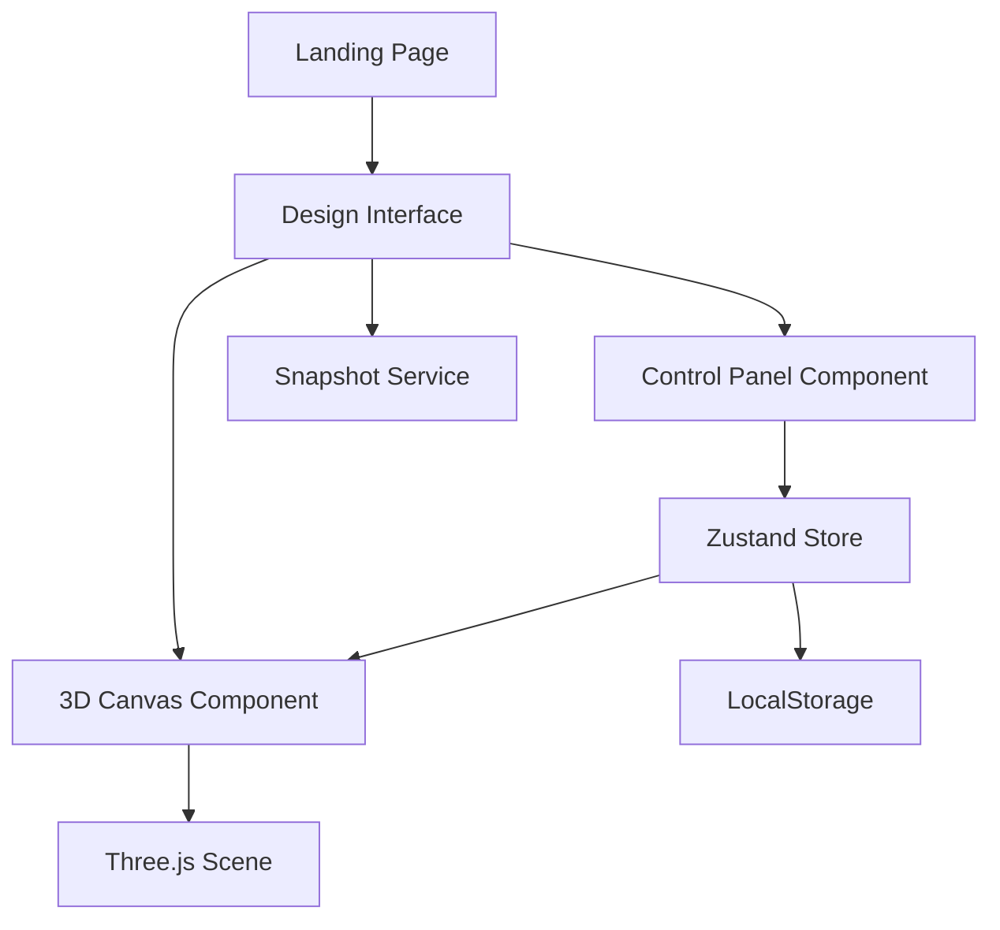

# Design Document

## Overview

The Smart Interior Design Previewer is a Next.js 14 application utilizing the App Router architecture. The system combines React Three Fiber for 3D rendering, Zustand for state management, Framer Motion for animations, and Tailwind CSS for styling. The architecture follows a component-based design with clear separation between UI controls, 3D rendering logic, and state management.

## Architecture

### High-Level Architecture



### Technology Stack

- **Framework**: Next.js 14 with App Router and TypeScript
- **3D Rendering**: React Three Fiber (@react-three/fiber) + Drei (@react-three/drei)
- **State Management**: Zustand
- **Styling**: Tailwind CSS
- **Animation**: Framer Motion
- **Snapshot Export**: html2canvas
- **Deployment**: Vercel

### Routing Structure

- `/` - Landing page with hero section and CTA
- `/preview/[room]` - Main design interface with dynamic room parameter

## Components and Interfaces

### Core Components

#### 1. Landing Page (`app/page.tsx`)
- Hero section with animated tagline
- Call-to-action button navigating to `/preview/living-room`
- Framer Motion animations for entry effects
- Responsive layout with Tailwind breakpoints

#### 2. Design Interface (`app/preview/[room]/page.tsx`)
- Main container managing layout between canvas and controls
- Responsive layout switching between sidebar (desktop) and bottom sheet (mobile)
- Integration of RoomCanvas and ControlPanel components

#### 3. RoomCanvas Component (`components/RoomCanvas.tsx`)
```typescript
interface RoomCanvasProps {
  roomType: 'living-room' | 'bedroom' | 'office';
  stylePreset: 'modern' | 'boho' | 'minimalist';
  colorTheme: 'warm' | 'cool' | 'neutral';
  lightingMood: 'morning' | 'evening' | 'night';
}
```
- Canvas wrapper with Three.js scene setup
- Camera controls (OrbitControls from Drei)
- Lighting configuration based on mood
- 3D model loading and rendering
- Material updates based on style and color selections

#### 4. ControlPanel Component (`components/ControlPanel.tsx`)
```typescript
interface ControlPanelProps {
  className?: string;
}
```
- Container for all design controls
- Integrates ThemeSelector, LightingSelector, and room type selector
- Animated panel with Framer Motion
- Glassmorphism styling

#### 5. ThemeSelector Component (`components/ThemeSelector.tsx`)
- Style preset selection (Modern, Boho, Minimalist)
- Color theme selection (Warm, Cool, Neutral)
- Visual indicators for active selections
- Hover animations

#### 6. LightingSelector Component (`components/LightingSelector.tsx`)
- Lighting mood selection (Morning, Evening, Night)
- Visual preview icons for each mood
- Active state highlighting

#### 7. SaveButton Component (`components/SaveButton.tsx`)
- Trigger for snapshot capture
- Loading state during capture
- Download initiation with formatted filename

#### 8. Header Component (`components/Header.tsx`)
- Application branding
- Navigation elements
- Responsive design

### State Management

#### Zustand Store (`lib/store.ts`)

```typescript
interface DesignStore {
  // State
  roomType: 'living-room' | 'bedroom' | 'office';
  stylePreset: 'modern' | 'boho' | 'minimalist';
  colorTheme: 'warm' | 'cool' | 'neutral';
  lightingMood: 'morning' | 'evening' | 'night';
  
  // Actions
  setRoomType: (type: string) => void;
  setStylePreset: (preset: string) => void;
  setColorTheme: (theme: string) => void;
  setLightingMood: (mood: string) => void;
  loadFromLocalStorage: () => void;
  saveToLocalStorage: () => void;
}
```

The store automatically persists changes to localStorage on every state update and loads saved preferences on initialization.

## Data Models

### Design Configuration

```typescript
interface DesignConfiguration {
  roomType: RoomType;
  stylePreset: StylePreset;
  colorTheme: ColorTheme;
  lightingMood: LightingMood;
}

type RoomType = 'living-room' | 'bedroom' | 'office';
type StylePreset = 'modern' | 'boho' | 'minimalist';
type ColorTheme = 'warm' | 'cool' | 'neutral';
type LightingMood = 'morning' | 'evening' | 'night';
```

### Theme Constants (`lib/constants.ts`)

```typescript
interface ThemeColors {
  warm: {
    primary: string;
    secondary: string;
    accent: string;
  };
  cool: {
    primary: string;
    secondary: string;
    accent: string;
  };
  neutral: {
    primary: string;
    secondary: string;
    accent: string;
  };
}

interface LightingConfig {
  morning: {
    ambientIntensity: number;
    directionalIntensity: number;
    directionalPosition: [number, number, number];
    color: string;
  };
  evening: {
    ambientIntensity: number;
    directionalIntensity: number;
    directionalPosition: [number, number, number];
    color: string;
  };
  night: {
    ambientIntensity: number;
    directionalIntensity: number;
    directionalPosition: [number, number, number];
    color: string;
  };
}
```

### 3D Model Structure

Models stored in `/public/models/`:
- `living-room.glb`
- `bedroom.glb`
- `office.glb`

Each model should include:
- Room geometry (walls, floor, ceiling)
- Furniture meshes with named materials
- Proper UV mapping for texture application
- Optimized polygon count for web performance

## 3D Scene Configuration

### Camera Setup
- Type: PerspectiveCamera
- Initial position: [5, 3, 5]
- FOV: 75
- Near/Far clipping: 0.1 / 1000

### Lighting System

```typescript
interface SceneLighting {
  ambient: {
    intensity: number;
    color: string;
  };
  directional: {
    intensity: number;
    position: [number, number, number];
    color: string;
    castShadow: boolean;
  };
}
```

Lighting configurations vary by mood:
- **Morning**: High ambient (0.8), warm directional from upper-right
- **Evening**: Medium ambient (0.5), orange directional from side
- **Night**: Low ambient (0.3), cool directional with moonlight effect

### Material System

Materials are dynamically updated based on style and color selections:

```typescript
interface MaterialConfig {
  color: string;
  roughness: number;
  metalness: number;
  emissive?: string;
  emissiveIntensity?: number;
}
```

Style-specific material properties:
- **Modern**: Low roughness (0.2), medium metalness (0.5), clean colors
- **Boho**: High roughness (0.8), low metalness (0.1), earthy tones
- **Minimalist**: Medium roughness (0.4), low metalness (0.2), muted colors

### Controls Configuration

OrbitControls settings:
- enableDamping: true
- dampingFactor: 0.05
- minDistance: 3
- maxDistance: 15
- maxPolarAngle: Math.PI / 2 (prevent viewing from below)
- enablePan: true
- panSpeed: 0.5

## Snapshot Export System

### Implementation Approach

Using html2canvas to capture the canvas element:

```typescript
interface SnapshotOptions {
  backgroundColor: string;
  scale: number;
  logging: boolean;
}

async function captureSnapshot(
  canvasRef: RefObject<HTMLCanvasElement>,
  config: DesignConfiguration
): Promise<void> {
  // Capture canvas
  // Generate filename with timestamp and config
  // Trigger download
}
```

Filename format: `interior-design-{roomType}-{timestamp}.png`

## LocalStorage Persistence

### Storage Schema

```typescript
interface StoredConfig {
  version: string; // For future migration support
  roomType: string;
  stylePreset: string;
  colorTheme: string;
  lightingMood: string;
  lastUpdated: number;
}
```

Storage key: `smart-interior-config`

### Persistence Strategy

- Save on every state change (debounced by 500ms)
- Load on application initialization
- Fallback to defaults if no saved config or parsing error
- Version field for future schema migrations

## Responsive Design Strategy

### Breakpoints (Tailwind)

- Mobile: < 768px
- Tablet: 768px - 1023px
- Desktop: ≥ 1024px

### Layout Adaptations

**Desktop (≥ 1024px)**:
- Sidebar control panel (fixed width: 320px)
- Canvas fills remaining space
- Horizontal layout

**Tablet/Mobile (< 1024px)**:
- Bottom sheet control panel (collapsible)
- Canvas fills viewport above controls
- Vertical layout
- Touch-optimized controls (min 44px touch targets)

### Performance Optimizations

- Simplified 3D models for mobile (lower poly count)
- Reduced shadow quality on mobile
- Conditional rendering of decorative elements
- Lazy loading of 3D models
- Memoization of expensive computations

## Animation System

### Framer Motion Variants

```typescript
const fadeInUp = {
  initial: { opacity: 0, y: 20 },
  animate: { opacity: 1, y: 0 },
  transition: { duration: 0.6, ease: 'easeOut' }
};

const slideIn = {
  initial: { x: -100, opacity: 0 },
  animate: { x: 0, opacity: 1 },
  transition: { duration: 0.4, ease: 'easeOut' }
};

const scaleIn = {
  initial: { scale: 0.9, opacity: 0 },
  animate: { scale: 1, opacity: 1 },
  transition: { duration: 0.3, ease: 'easeOut' }
};
```

### Transition Timing

- UI state changes: 300ms
- 3D material updates: 500ms (using lerp)
- Lighting transitions: 800ms (smooth fade)
- Panel animations: 400ms

## Error Handling

### 3D Model Loading

```typescript
try {
  const model = await loadModel(roomType);
  setModel(model);
} catch (error) {
  console.error('Failed to load model:', error);
  // Display fallback UI with error message
  // Retry mechanism with exponential backoff
}
```

### LocalStorage Errors

```typescript
try {
  const saved = localStorage.getItem('smart-interior-config');
  const config = JSON.parse(saved);
  return config;
} catch (error) {
  console.warn('Failed to load saved config:', error);
  return getDefaultConfig();
}
```

### Snapshot Capture Errors

```typescript
try {
  const canvas = await html2canvas(element);
  downloadImage(canvas);
} catch (error) {
  console.error('Snapshot failed:', error);
  // Show user-friendly error message
  // Provide alternative export options
}
```

## Testing Strategy

### Component Testing
- Test each UI component in isolation
- Verify prop handling and state updates
- Test responsive behavior at different breakpoints
- Validate accessibility (keyboard navigation, ARIA labels)

### Integration Testing
- Test state management flow (Zustand store updates)
- Verify localStorage persistence and retrieval
- Test navigation between pages
- Validate 3D scene updates based on state changes

### Visual Testing
- Verify 3D model rendering for each room type
- Test material and lighting updates
- Validate animations and transitions
- Check responsive layout adaptations

### Performance Testing
- Measure frame rate during 3D interactions
- Test load times for 3D models
- Verify smooth transitions on mobile devices
- Monitor memory usage during extended sessions

### Browser Compatibility
- Test on Chrome, Firefox, Safari, Edge
- Verify WebGL support detection
- Test touch interactions on mobile browsers
- Validate localStorage availability

## Deployment Configuration

### Next.js Configuration (`next.config.js`)

```javascript
module.exports = {
  images: {
    domains: [],
  },
  webpack: (config) => {
    config.module.rules.push({
      test: /\.(glb|gltf)$/,
      use: {
        loader: 'file-loader',
      },
    });
    return config;
  },
};
```

### Vercel Deployment
- Automatic deployments from main branch
- Preview deployments for pull requests
- Environment variables: None required for MVP
- Build command: `npm run build`
- Output directory: `.next`

### Asset Optimization
- 3D models compressed using gltf-pipeline
- Textures optimized to appropriate resolutions
- Static assets served from `/public` directory
- CDN caching for static resources

## Design System

### Color Palette

**Warm Theme**:
- Primary: #D4A574 (tan)
- Secondary: #8B4513 (saddle brown)
- Accent: #CD853F (peru)

**Cool Theme**:
- Primary: #4A90A4 (steel blue)
- Secondary: #2C5F75 (dark cyan)
- Accent: #7FB3D5 (light blue)

**Neutral Theme**:
- Primary: #A8A8A8 (gray)
- Secondary: #5A5A5A (dim gray)
- Accent: #D3D3D3 (light gray)

### Typography
- Font Family: Inter (primary), system fonts (fallback)
- Headings: 600-700 weight
- Body: 400 weight
- UI Elements: 500 weight

### Spacing System (Tailwind)
- Base unit: 4px (0.25rem)
- Component padding: 16px (1rem)
- Section spacing: 32px (2rem)
- Page margins: 24px (1.5rem)

### UI Patterns

**Glassmorphism Effect**:
```css
background: rgba(255, 255, 255, 0.1);
backdrop-filter: blur(10px);
border: 1px solid rgba(255, 255, 255, 0.2);
```

**Button Styles**:
- Primary: Solid background with hover scale
- Secondary: Outlined with hover fill
- Icon: Transparent with hover background

**Control Elements**:
- Radio buttons for single selection
- Visual cards for theme/style selection
- Sliders for future intensity controls
